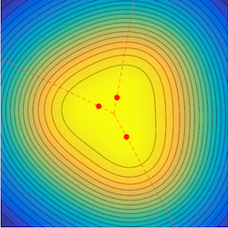
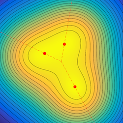
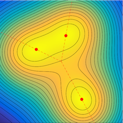

# 2017-MSL-super-resolution
Source code for the paper "Multi-dimensional Sparse Super-resolution"

It is composed of two toolboxes:
- symbolic-certificates/: computation of pre-certificates eta_V and eta_W, requires Matlab symbolic toolbox.
- frank-wolfe/: resolution of the BLASSO problem using Frank-Wolfe algorithm.

Copyright
-------

Copyright (c) 2017 Clarice Poon and Gabriel Peyré
